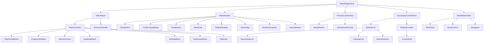

# Component Architecture Diagram

```mermaid
graph TD
    A[WatchPageClient] --> B[VideoPlayer]
    A --> C[MediaHeader]
    A --> D[PrimaryContentArea]
    A --> E[SecondaryContentArea]
    A --> F[MobileBottomBar]

    B --> B1[PlayerControls]
    B --> B2[GesturesHandler]

    B1 --> B11[PlayPauseButton]
    B1 --> B12[ProgressSeekBar]
    B1 --> B13[VolumeControl]
    B1 --> B14[CaptionsButton]
    B1 --> B15[SettingsMenu]
    B1 --> B16[FullscreenButton]
    B1 --> B17[PipButton]

    C --> C1[BackButton]
    C --> C2[ContentTypeBadge]
    C --> C3[HeroBanner]
    C --> C4[MediaTitle]
    C --> C5[MediaMetadata]
    C --> C6[GenreTags]
    C --> C7[MediaDescription]
    C --> C8[ActionButtons]

    D --> D1[MediaDetails]
    D --> D2[InteractiveElements]

    E --> E1[EpisodeList]
    E --> E2[RelatedContent]

    E1 --> E11[SeasonSelector]
    E1 --> E12[EpisodeGrid]
    E1 --> E13[EpisodeSearch]

    E2 --> E21[ContentGrid]

    F --> F1[MiniPlayer]
    F --> F2[QuickActions]
    F --> F3[Navigation]
```
