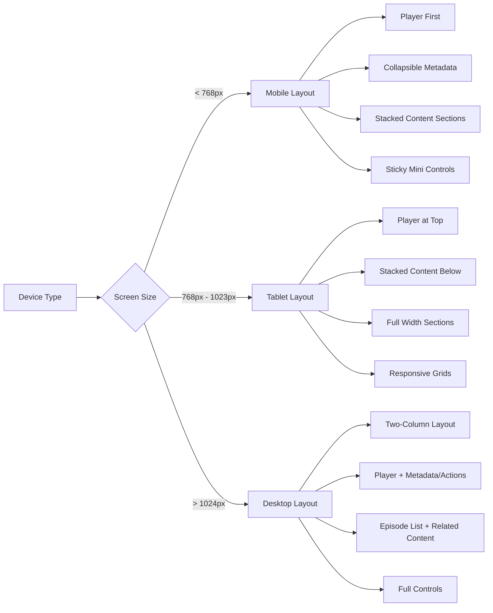

# Responsive Layout Flow

```mermaid
graph LR
    A[Device Type] --> B{Screen Size}
    B -->|< 768px| C[Mobile Layout]
    B -->|768px - 1023px| D[Tablet Layout]
    B -->|> 1024px| E[Desktop Layout]

    C --> C1[Player First]
    C --> C2[Collapsible Metadata]
    C --> C3[Stacked Content Sections]
    C --> C4[Sticky Mini Controls]

    D --> D1[Player at Top]
    D --> D2[Stacked Content Below]
    D --> D3[Full Width Sections]
    D --> D4[Responsive Grids]

    E --> E1[Two-Column Layout]
    E --> E2[Player + Metadata/Actions]
    E --> E3[Episode List + Related Content]
    E --> E4[Full Controls]
```
